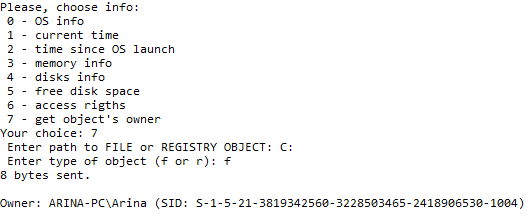

# data-collection-system-with-RPC
Client-Server data collection system for OS Windows with RPC

Разработана система сбора информации о компьютере, состоящая из программы-сервера и программы-клиента, работающих под ОС Windows.
Работа программ осуществляется через механизм удаленного вызова процедур (RPC). 
На сервере для имперсонации клиента применяется функция ImpersonateLoggedOnUser(), которая имперсонализирует вызывающий поток. Т.е поток, создавший процесс выдает за себя тот аккаунт, для которого был создан процесс.
Все сообщения между клиентом и сервером передаются в зашифрованном виде.

Соединение шифруется по схеме сеансового ключа посредством криптопровайдера, предоставляемого ОС Windows:
1) Клиент генерирует асимметричный ключ–пару ключей публичный/приватный;
2) Клиент посылает публичный ключ серверу;
3) Сервер генерирует сеансовый ключ;
4) Сервер получает публичный ключ клиента;
5) Сервер шифрует сеансовый ключ публичным ключом клиента и отправляет получившееся зашифрованное сообщение клиенту;
6) Клиент получает зашифрованное сообщение и расшифровывает его с помощью своего приватного ключа;
7) У клиента и сервера есть сеансовый ключ. Теперь можно использовать симметричное шифрование для защищенного обмена сообщениями.

Клиент может подключиться к серверу и получить данные о состоянии системы и файлов в системе, путем передачи зашифрованных сеансовым ключом пакетов данных.
Клиент может получить следующие типы информации:
-	Тип и версия ОС;

-	Текущее время;

-	Время, прошедшее с момента запуска ОС;

-	Типы подключенных дисков (локальный / сетевой / съемный, файловая система);

-	Информация об используемой памяти;

-	Свободное место на локальных дисках;

-	Владелец файла/папки/ключа реестра;

-	Права доступа в текстовом виде к указанному файлу/папке/ключу реестра;

